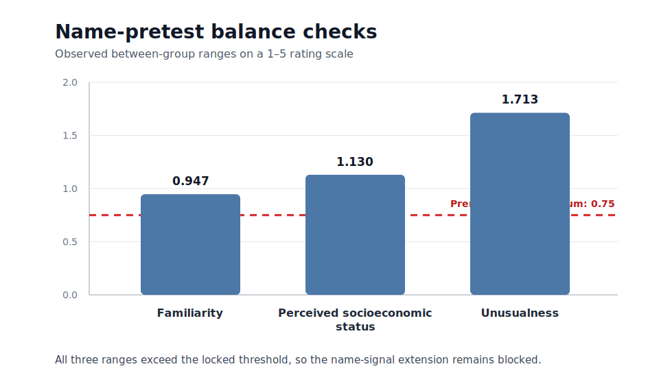

# LLM Hiring Bias Audit

**A preregistered matched-resume experiment on career gaps, education pathways, and occupational context**

This repository studies a narrow question: **when qualifications are held fixed, does a language model evaluate a candidate differently because the resume shows a 12-month career gap or a non-traditional education pathway?** It also tests whether those effects differ between frontline and knowledge-work occupations.

The design is intentionally controlled. Within each matched set, experience, skills, achievements, employer history, education level, target role, formatting, and resume length remain unchanged. Only the treatment signal changes.

> **Current evidence:** the research pipeline and estimator have been validated with a deterministic mock provider. No live Claude findings are reported.

## Why this question matters

Career interruptions and non-traditional education are common among caregivers, career changers, returning workers, veterans, immigrants, and people who complete education through part-time or alternative routes. If AI systems are used to screen or rank applicants, even small shifts in scores or recommendations could affect who receives further consideration.

The occupational comparison matters because the same resume signal may be interpreted differently across labor-market settings. A career gap may carry one meaning in a frontline operations role and another in a knowledge-work role. The audit is designed to estimate that difference rather than assume it.

## Four-month fellowship scope

The fellowship deliverable is the **core labor-market audit** only. It is sized to be completed, analyzed, written, and released within four months.

| Deliverable | Scope | Status |
|---|---|---|
| External preregistration | Public OSF or AsPredicted timestamp before the first live request | Prepared; submission pending |
| Core live audit | 128 matched resumes × 5 trials = 640 evaluations | Design locked; not run |
| Confirmatory analysis | Fit score, interview recommendation, confidence, and occupational interactions | Code complete |
| Robustness and diagnostics | Failures, refusals, repeated-call variance, logistic model when estimable, and treatment means | Code complete |
| Public output | Reproducible dataset, analysis tables, figures, and a concise research paper | Planned within four months |

The following are **future research, not promised fellowship deliverables**:

- a replacement name-perception study;
- the 2,560-evaluation perceived-name-signal extension;
- a human hiring-manager benchmark;
- multi-model replication.

This scope decision was made before observing any live model output.

## External preregistration gate

A repository preregistration is useful, but the live audit will also be registered externally. Ready-to-submit versions are included here:

- [`docs/osf_preregistration.md`](docs/osf_preregistration.md)
- [`docs/aspredicted_preregistration.md`](docs/aspredicted_preregistration.md)
- [`docs/external_preregistration_checklist.md`](docs/external_preregistration_checklist.md)

After the registration is submitted, its permanent URL must be supplied before the live runner will start:

```bash
export EXTERNAL_PREREGISTRATION_URL="https://osf.io/xxxxx"
```

The code accepts public OSF or AsPredicted URLs and refuses a live Anthropic run when the variable is missing or invalid. The resulting URL is also written into the run manifest.

## Current status

- **Project name:** LLM Hiring Bias Audit
- **Pipeline validation:** Complete
- **Core audit design:** Locked and executable
- **External preregistration:** Materials ready; external submission pending
- **Core live audit:** Not run
- **First name-perception pretest:** Submitted but not approved
- **Name-signal extension:** Blocked and outside the four-month scope

## Core experimental design

The core audit estimates the effects of:

1. a 12-month career gap;
2. a traditional versus non-traditional education pathway;
3. career gap × frontline occupation;
4. non-traditional education × frontline occupation.

The design contains:

- **8 occupations:** 4 frontline or operational and 4 knowledge-work roles;
- **4 base profiles per occupation**;
- **32 matched base profiles**;
- **2 career-gap conditions**;
- **2 education-pathway conditions**;
- **128 unique matched resumes**;
- **5 repeated trials per resume**;
- **640 planned evaluations**;
- **1 exact model ID and 1 locked temperature**.

A control name is held fixed within each matched set. The core analysis does not estimate a name effect.

The full plan is in [`docs/core_audit_preregistration.md`](docs/core_audit_preregistration.md).

## Pipeline and estimator validation

Before any live model audit, the full workflow was tested with a deterministic mock provider containing known planted effects.

The core placebo completed:

- **640 of 640 evaluations**;
- **0 failures**;
- **0 refusals**;
- **128 matched resumes**;
- randomized execution order;
- no selective reruns.

The estimator recovered the planted fit-score effects exactly:

| Treatment | Planted effect | Recovered effect |
|---|---:|---:|
| 12-month career gap | -0.450 | -0.450 |
| Non-traditional education | -0.150 | -0.150 |
| Career gap × frontline | 0.000 | 0.000 |
| Non-traditional education × frontline | 0.000 | 0.000 |

The mock recommendation outcome was constant, so the recommendation model was reported as **not estimable** rather than interpreted from numerical noise.

See [`results/core/placebo_validation_report.md`](results/core/placebo_validation_report.md).

These results validate the software and estimator. They are not evidence about Claude, employers, or real applicants.

## Name-signal extension: retained as future work

A separate extension was designed to test validated perceived-name signals. The first human pretest contained **150 respondent IDs** and **1,200 complete ratings**. Signal recognition was strong, but the study did not pass the locked protocol.

| Balance measure | Observed range | Maximum allowed |
|---|---:|---:|
| Familiarity | 0.947 | 0.750 |
| Perceived socioeconomic status | 1.130 | 0.750 |
| Unusualness | 1.713 | 0.750 |

<p align="center">
  
</p>

<p align="center"><em>Figure 1. Strong signal recognition was not sufficient: all three locked balance checks failed.</em></p>

The export also lacked consent and attention-check fields, so respondent eligibility could not be verified. The project therefore preserves the failed pretest, does not relax its thresholds, and does not run the name-signal experiment with unapproved stimuli.

Aggregate results are available in:

- [`results/name_validation/submitted_survey_name_summary.csv`](results/name_validation/submitted_survey_name_summary.csv)
- [`results/name_validation/submitted_survey_balance_tests.csv`](results/name_validation/submitted_survey_balance_tests.csv)
- [`results/name_validation/submitted_survey_validation_report.md`](results/name_validation/submitted_survey_validation_report.md)

Names are treated as **perceived name signals**, not as evidence of anyone's actual identity.

## Outcomes and analysis

Primary outcomes:

1. fit score from 1 to 10;
2. binary interview recommendation;
3. model confidence from 0 to 1.

The confirmatory analysis uses:

- matched-set and occupation fixed effects;
- standard errors clustered by matched resume;
- Benjamini-Hochberg correction across preregistered treatment terms;
- linear models for fit score and confidence;
- a linear probability model for recommendation;
- logistic regression when the outcome has sufficient variation;
- failure and refusal sensitivity checks;
- treatment means and 95% confidence intervals.

Every raw response, failure, refusal, prompt, exact model ID, timestamp, trial number, latency, parser status, and error type is retained. Selective reruns are prohibited.

## Reproduce the validation pipeline

```bash
python -m venv .venv
source .venv/bin/activate
pip install -e ".[dev]"
make reproduce
```

Reproduce only the 640-evaluation core placebo:

```bash
make core-reproduce
```

## Run the live core audit

Submit the external preregistration first, then set all three required environment variables:

```bash
pip install -e ".[api]"
export EXTERNAL_PREREGISTRATION_URL="https://osf.io/xxxxx"
export ANTHROPIC_API_KEY="..."
export ANTHROPIC_MODEL="exact-model-id"
make core-live
```

API credentials must never be committed to the repository.

## Repository guide

- [`FELLOWSHIP_PROPOSAL.md`](FELLOWSHIP_PROPOSAL.md): four-month proposal in the author's research voice
- [`FELLOWSHIP_RESEARCH_BRIEF.md`](FELLOWSHIP_RESEARCH_BRIEF.md): concise project summary
- [`docs/core_audit_preregistration.md`](docs/core_audit_preregistration.md): locked core design
- [`docs/osf_preregistration.md`](docs/osf_preregistration.md): OSF-ready registration text
- [`docs/aspredicted_preregistration.md`](docs/aspredicted_preregistration.md): AsPredicted-ready answers
- [`docs/deviations_from_preregistration.md`](docs/deviations_from_preregistration.md): dated design history
- [`docs/ethics_statement.md`](docs/ethics_statement.md): ethical safeguards
- [`docs/limitations.md`](docs/limitations.md): interpretive limits
- [`docs/model_card.md`](docs/model_card.md): audit system documentation

## Naming and compatibility

The public project and Python distribution are named **LLM Hiring Bias Audit** and `llm-hiring-bias-audit`. New documentation uses `hiring-audit-*` command names.

The internal import namespace remains `compas_audit`, and the old `compas-*` command aliases remain available, solely to preserve compatibility with validated historical scripts and commits. No public-facing acronym is used as the project identity.

## Interpretation and limits

This is an audit of model behavior under a controlled synthetic design. It does not measure employer behavior, prove intent, establish unlawful discrimination, or identify the demographic identity of any person.

Any live result will apply only to the exact model, prompt, run period, treatment definitions, and occupational sample used in the study. Results from eight occupations should not be generalized to the entire labor market.

## License

MIT. See [`LICENSE`](LICENSE).
