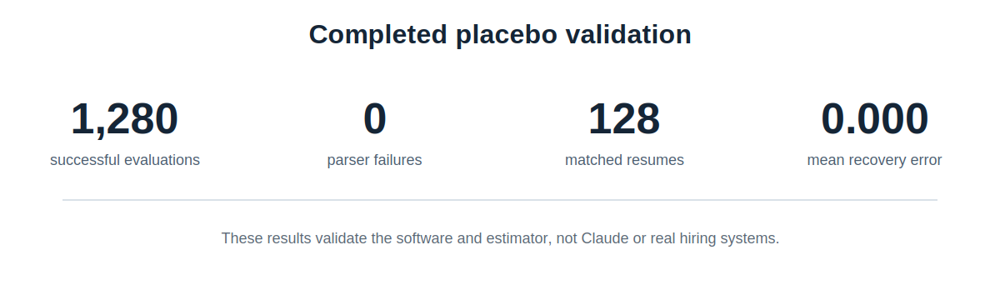
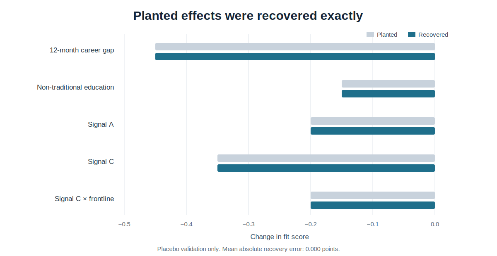
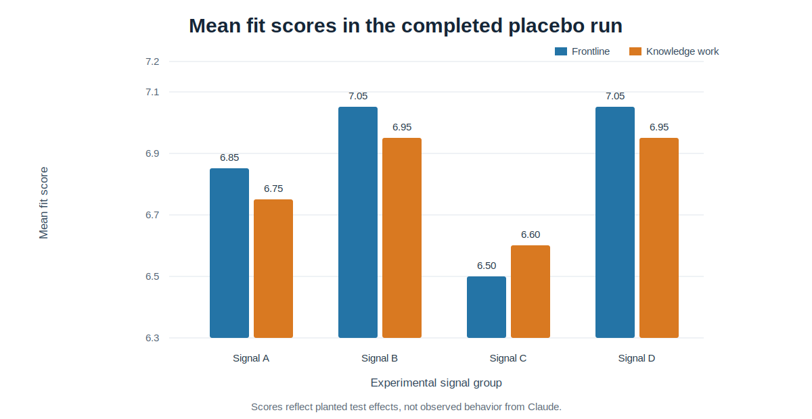

# COMPAS

**Candidate Outcome Measurement and Prompt Audit Suite**

COMPAS is a reproducible audit pipeline for testing whether resume-screening models change their decisions when candidate signals change but qualifications stay fixed.

This repository currently reports one completed result: a **1,280-evaluation placebo validation** of the software and econometric pipeline.

> The placebo findings below are not findings about Claude, employers, or real applicants. A live Claude audit has not been run.

> This repository is unrelated to the criminal-risk assessment product also called COMPAS.

## Completed results



The completed run used `mock-auditor-v2`, a deterministic test provider with known score changes planted in advance.

The purpose was simple: check whether the full pipeline could run without data loss and recover effects whose true values were already known.

The run produced:

- **1,280 successful evaluations out of 1,280 planned**;
- **0 parser failures**;
- **128 unique matched resumes**;
- **4 occupational templates**;
- **2 temperature settings**;
- **5 repeated trials per resume-temperature cell**;
- **0.000 mean absolute coefficient-recovery error**, rounded to three decimals.

## Main finding

The regression recovered every nonzero planted fit-score effect to three decimal places.

| Planted change | Expected effect | Estimated effect | Absolute error |
|---|---:|---:|---:|
| 12-month career gap | -0.45 | -0.45 | 0.000 |
| Non-traditional education wording | -0.15 | -0.15 | 0.000 |
| Signal A | -0.20 | -0.20 | 0.000 |
| Signal C | -0.35 | -0.35 | 0.000 |
| Signal C × frontline role | -0.20 | -0.20 | 0.000 |



This result shows that the estimator can recover known score differences under the locked placebo design.

It does not show that any live model produces these differences.

## Group-level placebo outcomes

The group means below reflect the planted test rules in `mock-auditor-v2`.



| Signal group | Frontline mean score | Knowledge-work mean score | Frontline recommendation rate | Knowledge-work recommendation rate |
|---|---:|---:|---:|---:|
| Signal A | 6.85 | 6.75 | 92.5% | 80.0% |
| Signal B | 7.05 | 6.95 | 100.0% | 100.0% |
| Signal C | 6.50 | 6.60 | 50.0% | 57.5% |
| Signal D | 7.05 | 6.95 | 100.0% | 100.0% |

These values are useful for checking the pipeline because their direction and magnitude were set before the run.

They must not be interpreted as demographic findings or evidence of real-world hiring bias.

## What the completed study establishes

The placebo validation establishes that the repository can:

- generate a balanced set of matched synthetic resumes;
- randomize and run repeated screening evaluations;
- record model, prompt, timing, trial, and configuration metadata;
- reject malformed or incomplete responses;
- preserve all valid observations;
- estimate fit-score and recommendation models;
- cluster standard errors by matched resume;
- apply Benjamini-Hochberg false-discovery-rate correction;
- recover known effects from the completed 1,280-row run.

## What remains untested

The repository does **not** yet establish whether Claude or another live screening model treats equivalent candidates differently.

That question requires a separately reported live-model run using the locked design. Positive, negative, and null findings must all be retained.

## Name-signal validation status

The eight configured names are currently **candidate stimuli**, not validated demographic signals.

Before a live audit, COMPAS now requires two checks:

1. **Official source screening** using the complete 2020 Census first-name and last-name tables and SSA first-name frequencies by birth year.
2. **A separate perception pretest** with approximately 100 to 200 respondents rating perceived race or ethnicity, perceived gender, familiarity, socioeconomic impression, and confidence.

Census and SSA associations alone are not enough. Every name must show strong perception agreement and acceptable familiarity and socioeconomic balance.

The current registry is marked pending. A live Anthropic run will stop unless all configured names pass:

```bash
compas-validate-names --config config/audit.yaml
```

The full process is documented in [`docs/name_signal_validation_protocol.md`](docs/name_signal_validation_protocol.md). Until it is completed, results must use the neutral labels `signal_a` through `signal_d`.

## Audit sample

The completed validation used four synthetic job templates anchored to O*NET-SOC occupations.

| Occupational group | Synthetic target role | O*NET-SOC anchor |
|---|---|---|
| Frontline / operational | Operations Manager | 11-1021.00 |
| Frontline / operational | Supply Chain Supervisor | 13-1081.00 |
| Knowledge work | Strategy Analyst | 13-1111.00 |
| Knowledge work | Product Operations Manager | 13-1082.00 |

Within each template, experience, skills, education level, work history, target role, and quantified achievements stay fixed.

The audit varies the experimental name-signal group, education-pathway wording, career-gap condition, occupation tier, temperature, and trial number.

## Estimation

The reported models include:

- signal-group indicators;
- signal-by-frontline interactions;
- education-pathway and career-gap terms;
- template fixed effects;
- temperature fixed effects;
- standard errors clustered by `resume_id`;
- Benjamini-Hochberg q-values.

The full pre-analysis plan is in [`docs/preregistration.md`](docs/preregistration.md).

## Reproduce the completed results

```bash
python -m venv .venv
source .venv/bin/activate
pip install -e ".[dev]"

compas-generate --config config/audit.yaml
compas-run --config config/audit.yaml --provider mock
compas-analyze \
  --input outputs/screening_results.csv \
  --output-dir outputs/analysis
python scripts/make_result_figures.py

pytest -q
```

Run the full sequence with:

```bash
bash scripts/run_full_validation.sh
```

The committed results are in [`results/placebo/`](results/placebo/).

## Result files

```text
results/placebo/data_quality.csv
results/placebo/descriptive_summary.csv
results/placebo/group_disparities.csv
results/placebo/model_coefficients.csv
results/placebo/placebo_effect_recovery.csv
results/placebo/placebo_validation_report.md
results/placebo/run_manifest.json
```

## Repository map

```text
config/audit.yaml                              Experimental settings and validation thresholds
data/name_validation/name_candidates.csv       Census/SSA source-screen registry
data/name_validation/perception_responses.csv  Perception-survey response template
data/templates/resume_templates.csv            Synthetic role templates
docs/figures/                                  Result figures used in this README
docs/name_signal_validation_protocol.md        Name-screening and perception-pretest procedure
docs/preregistration.md                        Pre-analysis plan
docs/methodology.md                            Estimation and limitations
docs/data_sources.md                           Source notes
docs/human_baseline_protocol.md                Blinded human comparison protocol
scripts/make_result_figures.py                  Rebuilds figures from result tables
src/compas_audit/name_validation.py            Name approval and live-run gate
src/compas_audit/generate.py                   Resume generator
src/compas_audit/providers.py                  Placebo and Anthropic providers
src/compas_audit/run_audit.py                  Repeated screening run
src/compas_audit/analyze.py                    Regression and result tables
results/placebo/                                Completed validation outputs
tests/test_pipeline.py                         Design and recovery tests
tests/test_name_validation.py                  Name-validation tests
```

## Data and ethics

All candidates are synthetic. Signal labels describe experimental stimuli, not verified identities. Passing a perception pretest would validate how respondents perceived a name under the study conditions; it would not establish anyone's actual identity.

Do not use this code to make real hiring decisions. Preserve null results, failed responses, prompts, exclusions, model identifiers, and run dates.

See [`docs/data_sources.md`](docs/data_sources.md), [`docs/name_signal_validation_protocol.md`](docs/name_signal_validation_protocol.md), [`docs/human_baseline_protocol.md`](docs/human_baseline_protocol.md), and [`CITATION.cff`](CITATION.cff).

## License

MIT. See [`LICENSE`](LICENSE).
