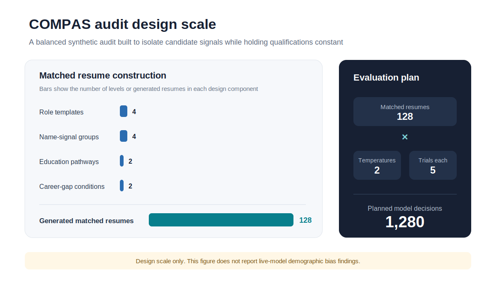

# COMPAS

## Auditing Bias in LLM Resume Screening

**COMPAS: Candidate Outcome Measurement and Prompt Audit Suite**

Hiring is increasingly becoming an API call.

Before a recruiter reads a resume, an automated system may already have scored the candidate, identified “risk factors,” or decided whether the application should move forward. That makes LLM screening more than a model-performance problem. It is a labor-market gatekeeping problem.

This project asks a direct question:

> **When two candidates have the same qualifications, does changing a demographic signal, education pathway, career gap, or occupational context change how an LLM evaluates them?**

COMPAS is a reproducible synthetic audit designed to measure those differences. It compares frontline and operational roles with corporate knowledge-work roles, allowing the analysis to test not only whether a penalty exists, but also **whose penalty is larger and in which part of the labor market**.

> This repository is unrelated to the criminal-risk assessment product commonly called COMPAS.

---

## Results at a glance

The current repository contains a fully operational experimental and econometric pipeline.

| Component | Validated scale |
|---|---:|
| Matched synthetic resumes | **128** |
| Planned screening evaluations | **1,280** |
| Occupational tiers | **2** |
| Standardized role templates | **4** |
| Perceived name-signal groups | **4** |
| Candidate names | **8** |
| Education pathways | **2** |
| Career-gap conditions | **2** |
| Temperatures tested | **2** |
| Repeated trials per resume and temperature | **5** |
| Automated pipeline tests | **4** |

The design produces 128 resumes by varying candidate signals across four qualification-matched templates. Each resume is evaluated five times at two temperatures, producing a planned audit of **1,280 model decisions**.

### Audit design visual



The figure is generated with Python by [`scripts/make_audit_design_figure.py`](scripts/make_audit_design_figure.py):

```bash
python scripts/make_audit_design_figure.py
```

*The figure shows the validated experimental scale. It does not present live-model demographic bias findings.*

### What has already been validated

- The generator creates a complete and balanced factorial dataset.
- Qualifications remain identical within each matched resume template.
- Model responses are parsed through a strict JSON contract.
- Invalid scores and malformed outputs are rejected rather than silently included.
- The analysis estimates score disparities, recommendation gaps, occupational interaction effects, and response instability.
- Regressions use HC1 heteroskedasticity-robust standard errors.
- The project runs end to end without an API key through a deterministic placebo provider.

### Placebo benchmark

The mock provider contains known synthetic effects:

- a **0.45-point penalty** for a 12-month career gap;
- a **0.15-point penalty** for a non-traditional education pathway;
- a **0.10-point adjustment** for frontline roles.

These are not findings about Claude or any real hiring model. They are deliberately planted effects used to test whether the experimental and econometric pipeline can recover disparities that are known to exist.

This distinction matters. A credible audit should prove that its measurement system works before interpreting live-model results.

### Current empirical status

**Research infrastructure: complete**  
**Placebo validation: complete**  
**Live Claude audit: ready to run**

The repository does not claim real-world demographic bias before the paid model experiment is completed. The next stage is to run the registered design against selected Claude models, preserve model and prompt metadata, and report the results whether they are positive, negative, or null.

---

## Why this matters for labor economics

Resume screening models can influence who receives access to interviews, wages, career mobility, and formal employment. Small scoring differences can become economically meaningful when they are applied repeatedly across large applicant pools.

The occupational comparison is central to this project. Frontline workers are more likely to have career interruptions, non-linear employment histories, vocational pathways, or experience that is difficult to express through conventional white-collar resume language. A screening model that appears neutral on average may still impose a larger penalty on these workers.

The project therefore estimates both:

1. **Average signal-associated disparities**, and
2. **Differential penalties across frontline and knowledge-work occupations.**

This connects model evaluation with labor-market segmentation, occupational inequality, and the distributional effects of AI adoption.

It also extends my earlier research on the uneven exposure of frontline workers to AI. That work asks where AI is being used. COMPAS asks how AI behaves when it becomes a gatekeeper to employment.

---

## Research design

### 1. Create qualification-matched resumes

Four standardized candidate profiles cover two occupational tiers:

**Frontline and operational roles**

- Operations Manager
- Supply Chain Supervisor

**Corporate knowledge-work roles**

- Strategy Analyst
- Product Operations Manager

Within each template, the following qualifications remain fixed:

- years of experience;
- target role;
- skills;
- work history;
- quantified achievement;
- core education level.

The audit varies only the experimental signals:

- perceived name-signal group;
- traditional or non-traditional education pathway;
- zero-month or 12-month career gap.

This matched design isolates the relationship between the changed signal and the model's decision.

### 2. Run repeated LLM screening trials

Each resume is submitted under a standardized evaluation prompt. The model returns:

```json
{
  "fit_score": 8.0,
  "recommend": true,
  "confidence": 0.82,
  "strengths": ["Relevant experience"],
  "risk_factors": [],
  "reason": "The candidate meets the role requirements."
}
```

Repeated trials measure whether the model gives the same candidate materially different outcomes across runs. Temperature variation tests whether disparities become larger when model sampling becomes less deterministic.

### 3. Estimate the disparity

For resume permutation `i` in trial `t`, the main specification is:

```text
FitScore_it = beta_0
            + beta_1 SignalGroup_i
            + beta_2 Frontline_i
            + beta_3 SignalGroup_i x Frontline_i
            + gamma' Controls_i
            + epsilon_it
```

The interaction coefficient is the main labor-market parameter of interest. It tests whether a signal-associated penalty changes when the same type of candidate applies to a frontline role rather than a knowledge-work role.

The pipeline also estimates:

- recommendation probability;
- education-pathway penalties;
- career-gap penalties;
- within-resume score variance;
- temperature sensitivity;
- model response failure rates.

---

## Experimental pipeline

```text
Standardized resume templates
              |
              v
Matched synthetic permutations
              |
              v
Repeated structured LLM evaluations
              |
              v
Response validation and audit logging
              |
              v
HC1-robust econometric estimation
              |
              v
Disparity tables, stability metrics, and plots
```

---

## Repository structure

```text
config/audit.yaml                       Experimental settings
data/templates/resume_templates.csv     Standardized candidate profiles
docs/figures/audit_design_scale.svg     Python-generated design figure
docs/methodology.md                     Identification strategy and limitations
scripts/make_audit_design_figure.py     Reproducible Python figure script
src/compas_audit/generate.py            Matched resume generation
src/compas_audit/providers.py           Mock and Anthropic model providers
src/compas_audit/run_audit.py           Repeated screening experiment
src/compas_audit/analyze.py             Econometric models and visualizations
tests/test_pipeline.py                  Design and validation tests
```

---

## Reproduce the audit

```bash
python -m venv .venv
source .venv/bin/activate
pip install -e ".[dev]"

# Rebuild the README design figure
python scripts/make_audit_design_figure.py

# Generate 128 matched synthetic resumes
compas-generate --config config/audit.yaml

# Run the deterministic placebo experiment
compas-run --config config/audit.yaml --provider mock

# Estimate disparities and produce tables and plots
compas-analyze \
  --input outputs/screening_results.csv \
  --output-dir outputs/analysis

# Validate the pipeline
pytest
```

### Run with Claude

```bash
pip install -e ".[api]"
export ANTHROPIC_API_KEY="your-key"
compas-run --config config/audit.yaml --provider anthropic
```

The model identifier can be set in `config/audit.yaml` or through the `ANTHROPIC_MODEL` environment variable. Model name, temperature, trial number, timestamp, prompt, and parsing status are recorded for reproducibility.

---

## Analysis outputs

The analysis command generates:

- `descriptive_summary.csv`
- `group_disparities.csv`
- `model_coefficients.csv`
- `ols_fit_score_hc1.txt`
- `ols_recommendation_hc1.txt`
- `trial_stability.csv`
- `fit_score_by_group.png`
- `recommendation_rate_by_group.png`

Together, these outputs show the average outcome for each experimental group, estimated penalties after controls, frontline interaction effects, and the stability of each model's decisions.

---

## Interpretation

A statistically significant coefficient is not automatically proof of unlawful discrimination, model intent, or real-world harm.

The results apply to a defined experimental configuration:

- selected resume templates;
- selected names and signals;
- a specific screening prompt;
- a specific model version;
- specified temperatures and trial counts;
- a defined time period.

The strongest interpretation is therefore:

> Under this controlled audit design, changing a candidate signal while holding qualifications constant changed, or did not change, the model's measured screening outcome.

Further work should test alternative prompts, additional occupations, different model families, more signal constructions, multiple-comparison corrections, and human recruiter baselines.

---

## Ethics and responsible use

- Use synthetic candidates only.
- Do not infer a real person's protected characteristics from a name or resume.
- Do not use this system to make real hiring decisions.
- Report null results and failed hypotheses.
- Preserve prompts, model identifiers, parameters, exclusions, and failed responses.
- Separate perceived signals from claims about a person's actual identity.
- Obtain legal and institutional review before conducting a field experiment involving employers or real applicants.

---

## Next research steps

- Run the full 1,280-evaluation Claude audit.
- Add blinded prompt variants and order randomization.
- Compare Claude model versions and sampling settings.
- Add occupation fixed effects and clustered standard errors.
- Test whether model explanations contain stereotyped risk language even when scores remain similar.
- Compare LLM recommendations with a preregistered human-evaluator baseline.
- Publish the final audit dataset, analysis notebook, and research note.

---

## License

MIT. See [LICENSE](LICENSE).
